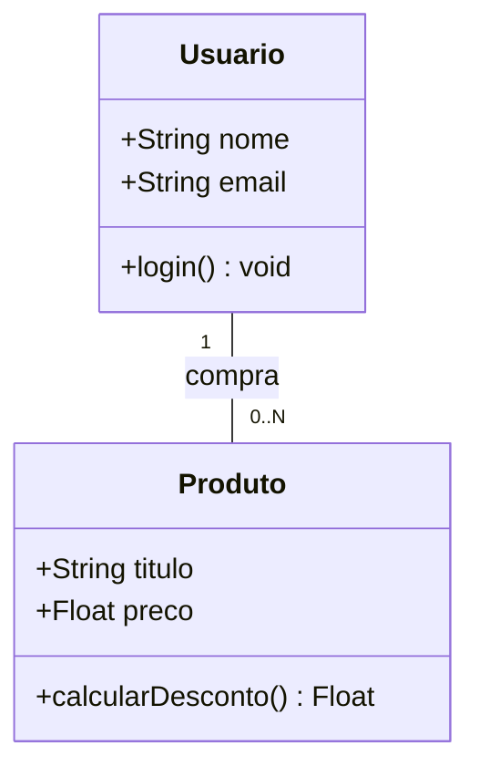

# Biblioteca_POO

# Prova em grupo — Construa o backend do seu sistema

Disciplina: Programação Orientada a Objetos
Integrante: Letícia Pires do Rosário.

Diagrama de classes

```mermaid
classDiagram
    class Usuario {
        +String nome
        +String email
        +login() void
    }
    class Produto {
        +String titulo
        +Float preco
        +calcularDesconto() Float
    }
    Usuario "1" -- "0..N" Produto : compra
```
