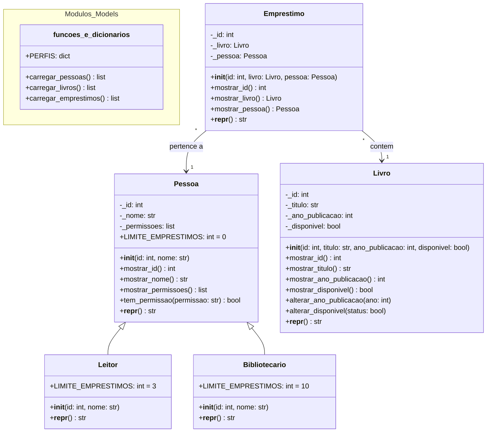

# Biblioteca_POO

# Prova — Construa o backend do seu sistema

Disciplina: Programação Orientada a Objetos

Integrante: Letícia Pires do Rosário.

Diagrama de classes:

Tabela de Rotas:

| Verbo HTTP |  Rota       | Descrição                                         | Códigos de Retorno |
| ---------- | ----------- | ------------------------------------------------- | ------------------ |
| GET        | /api/livros | Retorna a lista completa do acervo da biblioteca. | 200 OK             |
| GET        | /api/livros/{id} | Busca os detalhes de um livro específico pelo seu ID. | 200 OK ou 404 "Not Found" |
| GET        | /api/livros/disponiveis | Retorna apenas os livros que não estão emprestados no momento. | 200 OK |
| POST       | /api/emprestimos | Registra um novo empréstimo vinculando Livro e Pessoa. | "201 Created, 404 Not Found (ID inexistente), 409 Conflict (Livro já emprestado), 422 Unprocessable Entity (Limite de empréstimos atingido)" |
| GET        | /api/pessoas/{id}/emprestimos, | Lista os empréstimos ativos de uma pessoa (trazendo os dados do livro e da pessoa). | 200 OK ou 404 "Not Found" |
| POST       | /api/login, | Simula o login recebendo dados do mock e retornando o perfil (Leitor ou Bibliotecario) e suas permissões. | 200 OK, 404 "Not Found" |
